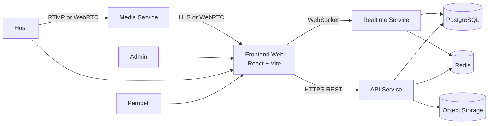
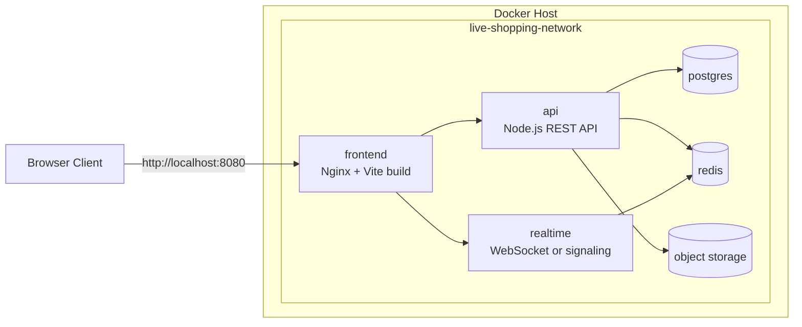
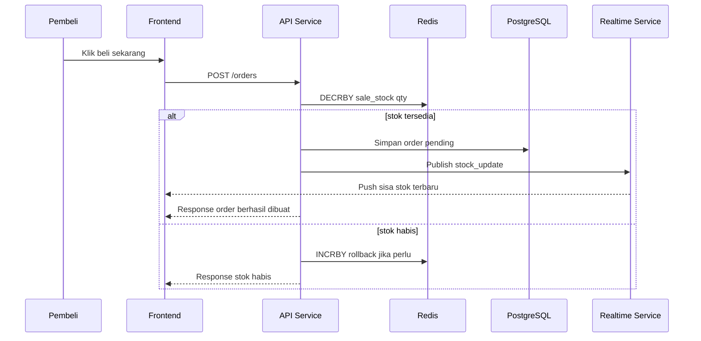
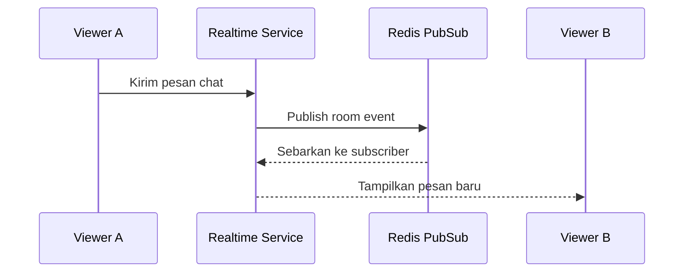
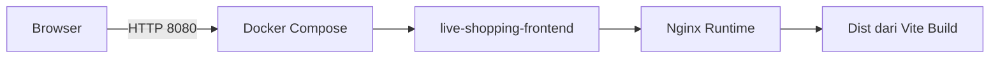

# Arsitektur Sistem
## Live Shopping Flash Sale

Dokumen ini menjelaskan arsitektur teknis target sistem, status implementasi repo saat ini, dan bagaimana proyek ini dihubungkan ke Docker untuk pengembangan serta deployment awal.

## 1. Status Implementasi Saat Ini

Saat dokumen ini ditulis, repositori sudah memiliki:

- frontend React + Vite,
- dokumentasi desain produk,
- dokumentasi PRD,
- `Dockerfile` untuk build produksi frontend,
- `docker-compose.yml` untuk menjalankan frontend di Docker.

Komponen backend, realtime, database, dan cache pada dokumen ini masih berstatus blueprint arsitektur implementasi berikutnya.

## 2. Gambaran Sistem Target



## 3. Container View Dengan Docker

Diagram berikut menunjukkan rancangan deployment berbasis Docker Compose untuk lingkungan pengembangan dan demo proyek.



Catatan implementasi:

- Yang benar-benar tersedia di repo saat ini adalah container `frontend`.
- Service `api`, `realtime`, `postgres`, `redis`, dan `object storage` adalah target stack yang harus ditambahkan pada fase implementasi backend.
- Semua service dirancang untuk berada pada network Docker yang sama agar komunikasi antar-service tetap sederhana pada lingkungan development.

## 4. Komponen Utama

### 4.1 Frontend Web

- Framework: React 19, Vite 8, Tailwind CSS v4.
- Tanggung jawab: daftar siaran, room live, kartu flash sale, chat panel, checkout, dashboard host, panel admin.
- Integrasi: REST untuk data CRUD dan order; WebSocket untuk chat, presence, dan update stok.

### 4.2 API Service

- Menangani autentikasi, otorisasi, CRUD produk, stream, flash sale, dan order.
- Menyimpan data persisten ke PostgreSQL.
- Menggunakan Redis untuk cache, sinkronisasi stok, dan operasi atomik.

### 4.3 Realtime Service

- Menangani room chat, presence, push stok, dan event siaran.
- Mengonsumsi pub/sub Redis untuk sinkronisasi lintas instance.
- Menjadi jalur komunikasi real-time antara frontend dan backend.

### 4.4 Media Service

- Menangani ingest stream dari host.
- Menyediakan distribusi stream ke penonton lewat WebRTC atau HLS.
- Dapat dipisahkan dari realtime service agar scaling media tidak bercampur dengan scaling chat.

### 4.5 Data Layer

- PostgreSQL sebagai source of truth data produk, order, user, dan stream.
- Redis sebagai layer cepat untuk stok flash sale, pub/sub, session singkat, dan cache.
- Object storage untuk gambar produk, thumbnail, dan rekaman siaran bila diperlukan.

## 5. Model Data Inti

```text
User
  id, name, email, password_hash, role, status, created_at

Product
  id, host_id, name, description, image_url, normal_price, stock, created_at

Stream
  id, host_id, title, status, started_at, ended_at, viewer_peak

FlashSale
  id, product_id, stream_id, sale_price, sale_stock, quota_per_user,
  start_time, end_time, status

Order
  id, buyer_id, flash_sale_id, quantity, total_price, status, created_at

ChatMessage
  id, stream_id, user_id, content, created_at
```

Relasi utama:

- satu host memiliki banyak produk,
- satu stream dapat memiliki banyak sesi flash sale,
- satu flash sale menghasilkan banyak order,
- satu stream memiliki banyak chat message.

## 6. Alur Kritis

### 6.1 Pembelian Flash Sale



### 6.2 Live Chat dan Presence



## 7. Keputusan Arsitektur

| Keputusan | Alasan |
|-----------|--------|
| Pisahkan frontend, API, dan realtime | pola beban dan strategi scaling berbeda |
| Redis untuk stok flash sale | operasi atomik lebih cepat dan aman dari race condition |
| PostgreSQL sebagai source of truth | relasi data transaksi lebih kuat dan konsisten |
| Docker untuk packaging awal | memudahkan demo, deployment, dan konsistensi environment |
| Nginx untuk runtime frontend | ringan, stabil, dan cocok untuk static build Vite |

## 8. Deployment Docker Di Repo Ini

### 8.1 Artefak Docker yang Tersedia

- `Dockerfile` menggunakan multi-stage build dari `node:22-alpine` ke `nginx:alpine`.
- `docker-compose.yml` menjalankan service `frontend` pada port `8080`.
- `nginx.conf` mengaktifkan fallback `index.html` agar siap untuk SPA routing.
- `.dockerignore` mengurangi ukuran build context.

### 8.2 Jalur Request Saat Ini



### 8.3 Perintah Operasional

```bash
docker compose up --build -d
docker compose down
```

## 9. Keamanan dan Keandalan

- Gunakan JWT dan RBAC untuk membedakan buyer, host, dan admin.
- Tambahkan rate limiting pada checkout dan chat untuk mencegah abuse.
- Sanitasi input chat untuk mencegah XSS.
- Audit log untuk perubahan status order dan moderasi admin.
- Backup periodik untuk PostgreSQL dan object storage.

## 10. Skalabilitas

- Frontend dapat dipasang di CDN atau reverse proxy bila sudah stabil.
- API dapat di-scale horizontal di belakang load balancer.
- Realtime service dapat memakai Redis adapter agar room sinkron antar-instance.
- Media service diisolasi supaya lonjakan streaming tidak mengganggu transaksi.

## 11. Roadmap Arsitektur

1. Tahap 1: frontend + Docker packaging untuk demo.
2. Tahap 2: monolithic API sederhana + PostgreSQL + Redis.
3. Tahap 3: realtime service terpisah untuk chat dan update stok.
4. Tahap 4: integrasi media service dan observability.
5. Tahap 5: optimasi scaling, keamanan, dan deployment cloud.

Arsitektur ini sengaja dibuat bertahap agar sesuai dengan progres proyek kelompok: bisa didemokan sekarang, tetapi tetap punya jalur evolusi yang jelas menuju sistem live commerce yang lebih realistis.
