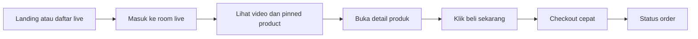

# Desain Produk
## Live Shopping Flash Sale

Dokumen ini menjelaskan desain produk dari sisi struktur halaman, modul UI, pengalaman pengguna, dan pembagian area kerja implementasi untuk proyek kelompok.

## 1. Tujuan Desain

Desain Live Shopping Flash Sale harus memenuhi tiga hal:

- membantu pembeli memahami produk dengan cepat,
- menciptakan urgensi pembelian melalui countdown dan stok,
- menjaga semua aksi penting tetap berada dalam satu layar live.

## 2. Prinsip Desain

### 2.1 Fokus pada produk yang sedang dijual

Produk yang sedang dipromosikan harus selalu terlihat jelas melalui pinned product card, harga promo, countdown, dan stok.

### 2.2 Interaksi real-time tetap ringan

Chat, viewer count, dan update stok tidak boleh mengganggu fokus pengguna pada video dan CTA pembelian.

### 2.3 Checkout sependek mungkin

Setelah tertarik, pembeli harus bisa membeli dalam alur yang sederhana tanpa berpindah terlalu banyak layar.

## 3. Struktur Pengalaman Pengguna

## 4. Modul Halaman Utama

### 4.1 Halaman Daftar Siaran

Komponen inti:

- hero section untuk sesi unggulan,
- grid daftar siaran live dan terjadwal,
- badge status live atau upcoming,
- ringkasan host, kategori, dan CTA masuk room.

Tujuan layar ini adalah membawa pengguna ke sesi yang paling relevan secepat mungkin.

### 4.2 Halaman Room Live Penonton

Komponen inti:

- video player live,
- pinned product card,
- countdown flash sale,
- progress atau sisa stok,
- tombol beli sekarang,
- panel chat,
- informasi host dan viewer count.

Prioritas visual pada layar ini:

1. video dan produk yang sedang dijual,
2. harga promo, stok, dan countdown,
3. chat dan interaksi sekunder.

### 4.3 Dashboard Host

Komponen inti:

- daftar produk,
- form pengaturan flash sale,
- kontrol pin produk,
- statistik viewer dan penjualan,
- daftar order yang masuk.

Host harus bisa berpindah dari mode persiapan ke mode live tanpa konteks yang rumit.

### 4.4 Panel Admin

Komponen inti:

- verifikasi akun host,
- monitoring siaran aktif,
- monitoring order dan aktivitas mencurigakan,
- aksi moderasi sederhana.

## 5. Struktur Informasi per Peran

| Peran | Kebutuhan utama | Fokus desain |
|-------|------------------|--------------|
| Pembeli | menonton, memahami produk, membeli cepat | live room yang ringkas dan jelas |
| Host | menyiarkan, mengatur promo, memantau performa | kontrol cepat dan statistik real-time |
| Admin | memverifikasi, mengawasi, menindak | dashboard monitoring dan status sistem |

## 6. Desain Interaksi Kunci

### 6.1 Flash Sale Card

Flash sale card minimal menampilkan:

- nama produk,
- foto produk,
- harga normal dan harga promo,
- countdown,
- sisa stok,
- batas kuota per user,
- tombol beli sekarang.

Card ini harus selalu sinkron dengan data realtime sehingga perubahan stok atau berakhirnya sesi segera terlihat.

### 6.2 Chat Panel

Chat panel dirancang sebagai pendukung keputusan pembelian, bukan distraksi utama. Karena itu:

- tinggi panel dibatasi,
- pesan baru tetap mengalir cepat,
- host atau admin dapat memoderasi,
- pertanyaan pembeli bisa dibalas tanpa meninggalkan room.

### 6.3 Checkout Cepat

Alur checkout MVP cukup mencakup:

- konfirmasi produk dan kuantitas,
- ringkasan harga,
- tombol konfirmasi order.

Integrasi pembayaran penuh dapat ditambahkan pada fase berikutnya.

## 7. Rekomendasi Pembagian Implementasi Tim

| Area | Penanggung jawab |
|------|------------------|
| UI daftar live dan room viewer | frontend |
| dashboard host dan panel admin | frontend |
| auth, produk, flash sale, order | backend |
| chat, presence, stok real-time | realtime |
| docker, deployment, observability | devops |
| test scenario, dokumen, demo | QA dan dokumentasi |

## 8. Deliverable Desain Minimum

Untuk presentasi proyek kelompok, dokumen desain dianggap cukup jika tim memiliki:

- penjelasan peran pengguna,
- daftar modul per halaman,
- alur pembeli dari masuk room hingga checkout,
- peta area implementasi untuk tiap anggota tim,
- keterkaitan desain dengan PRD dan arsitektur teknis.

## 9. Hubungan Dengan Dokumen Lain

- [PRD.md](./PRD.md) menjelaskan kebutuhan bisnis dan acceptance criteria.
- [ARCHITECTURE.md](./ARCHITECTURE.md) menjelaskan implementasi teknis dan deployment Docker.

Dokumen desain ini menjadi jembatan antara tujuan produk dan realisasi teknis di repository.