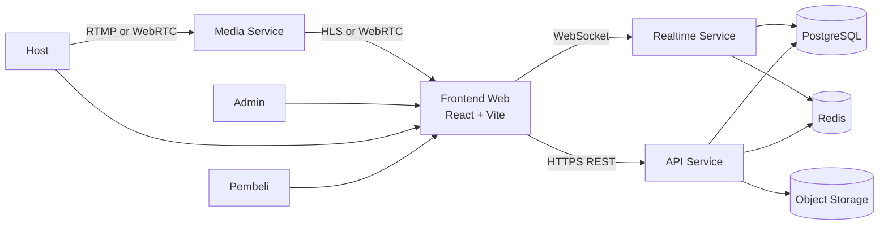
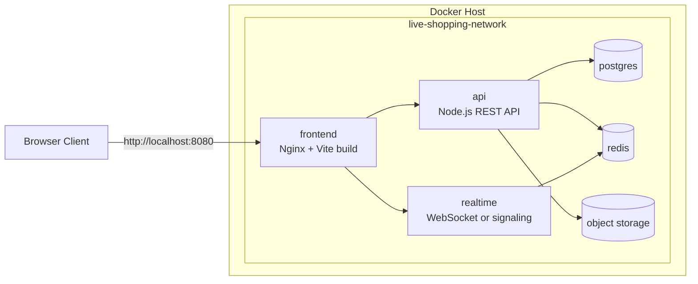
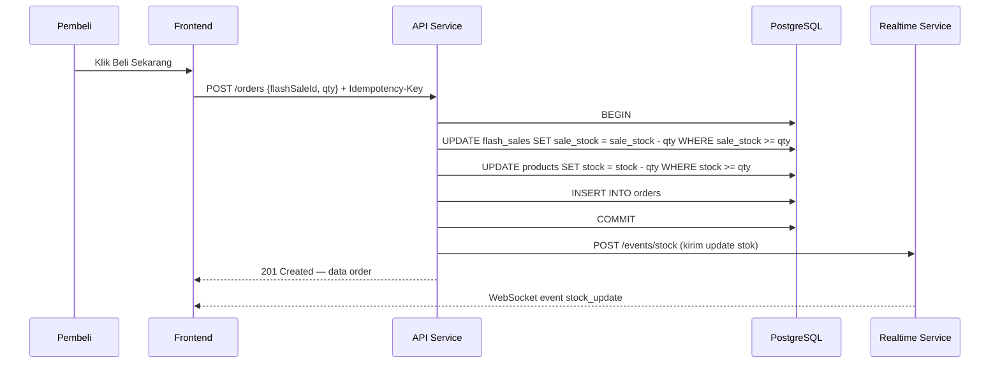
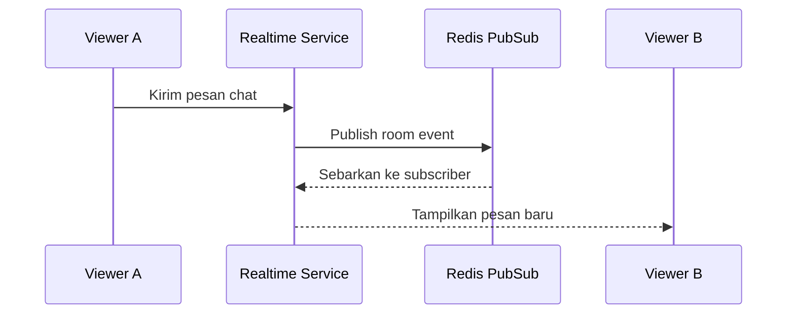
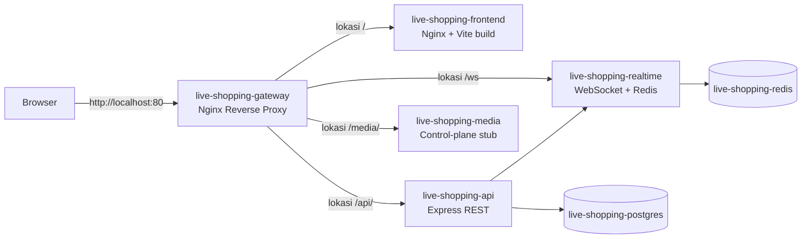

# Arsitektur Sistem
## Live Shopping Flash Sale

Dokumen ini menjelaskan arsitektur teknis target sistem, status implementasi repo saat ini, dan bagaimana proyek ini dihubungkan ke Docker untuk pengembangan serta deployment awal.

## 1. Status Implementasi Saat Ini

Saat dokumen ini ditulis, repositori sudah memiliki:

- frontend React + Vite dengan UI lengkap 6 halaman bertema Mobbin-inspired,
- backend Express + PostgreSQL dengan seluruh endpoint MVP aktif,
- realtime service berbasis WebSocket dan Redis pub/sub,
- media service control-plane stub untuk sesi ingest dan playback,
- Nginx gateway sebagai reverse proxy antar-service,
- dokumentasi desain produk, PRD, dan arsitektur,
- Dockerfile untuk setiap service,
- docker-compose.yml untuk menjalankan seluruh stack,
- mock data dan fallback mode untuk demo tanpa backend.

Object storage dan pipeline media produksi penuh masih berstatus blueprint arsitektur implementasi berikutnya.

## 2. Gambaran Sistem Target



## 3. Container View Dengan Docker

Diagram berikut menunjukkan rancangan deployment berbasis Docker Compose untuk lingkungan pengembangan dan demo proyek.



Catatan implementasi:

- Yang benar-benar tersedia di repo saat ini adalah container `frontend`, `api`, `realtime`, `media`, `postgres`, dan `redis`.
- `media` saat ini masih control-plane stub, belum server HLS atau WebRTC penuh.
- `object storage` masih menjadi target stack fase berikutnya.
- Semua service dirancang untuk berada pada network Docker yang sama agar komunikasi antar-service tetap sederhana pada lingkungan development.

## 4. Komponen Utama

### 4.1 Frontend Web

- Framework: React 19, Vite 8, TypeScript, Tailwind CSS v4.
- Tema visual: Mobbin-inspired — minimalis, card-based layout, Inter font, badge status berwarna.
- Halaman yang diimplementasikan:
  - **BrowsePage**: daftar siaran live/terjadwal/ended, grid 3 kolom, filter tab, hero featured stream.
  - **LiveRoomPage**: video area dengan gradient + badge LIVE, flash sale card, countdown real-time, stok progress bar, checkout modal, live chat panel.
  - **AuthModal**: login dan register dengan role selector, fallback demo mode jika API offline.
  - **HostDashboard**: 5 tab — ringkasan (stats + quick actions), siaran, produk, flash sale, pesanan.
  - **AdminDashboard**: 4 tab — ringkasan (monitoring live + alerts), pengguna (blokir/aktifkan), siaran, transaksi.
  - **BuyerOrders**: riwayat pesanan buyer dengan status dan detail produk.
- Integrasi:
  - REST API via `/api/` proxy (Vite dev proxy → backend port 3000; Nginx gateway di produksi).
  - WebSocket via `/ws` proxy (Vite dev proxy → realtime port 4000; Nginx gateway di produksi).
  - Fallback mock data otomatis jika backend tidak tersedia.
- Demo akun:
  - Email `admin@flashlive.id` → role admin.
  - Email/password lain → role sesuai pilihan saat registrasi.

### 4.2 API Service

- Menangani autentikasi, otorisasi, CRUD produk, stream, flash sale, dan order.
- Implementasi saat ini sudah menyediakan endpoint `GET /health`, `GET /catalog`, dan `POST /orders`.
- Menyimpan data persisten ke PostgreSQL.
- Untuk MVP sekarang, operasi stok atomik memakai query `UPDATE ... WHERE sisa >= qty RETURNING ...` di PostgreSQL.
- Redis tetap menjadi opsi evolusi saat write contention meningkat dan realtime service mulai dipisah.

### 4.3 Realtime Service

- Menangani room chat, presence, push stok, dan event siaran.
- Mengonsumsi pub/sub Redis untuk sinkronisasi lintas instance.
- Menjadi jalur komunikasi real-time antara frontend dan backend.

Implementasi saat ini menyediakan:

- endpoint `GET /health`, `GET /rooms/:streamId/presence`, `POST /events/chat`, dan `POST /events/stock`,
- WebSocket endpoint `GET /ws?streamId=...`,
- broadcast lokal bila Redis tidak dikonfigurasi, dan Redis pub/sub bila `REDIS_URL` tersedia.

### 4.4 Media Service

- Menangani ingest stream dari host.
- Menyediakan distribusi stream ke penonton lewat WebRTC atau HLS.
- Dapat dipisahkan dari realtime service agar scaling media tidak bercampur dengan scaling chat.

Implementasi saat ini masih berupa control-plane stub yang menyediakan:

- `POST /sessions` untuk membuat metadata sesi ingest dan playback,
- `GET /sessions/:sessionId` dan `PATCH /sessions/:sessionId` untuk membaca atau memperbarui status sesi,
- placeholder URL RTMP, HLS, dan WebRTC untuk memudahkan integrasi tahap berikutnya.

### 4.5 Data Layer

- PostgreSQL sebagai source of truth data produk, order, user, dan stream.
- Redis sebagai layer cepat untuk stok flash sale, pub/sub, session singkat, dan cache.
- Object storage untuk gambar produk, thumbnail, dan rekaman siaran bila diperlukan.

Implementasi saat ini memakai:

- PostgreSQL untuk tabel `users`, `sessions`, `products`, `streams`, `flash_sales`, `orders`, `chat_messages`, dan `idempotency_keys`,
- Redis untuk pub/sub realtime service,
- object storage masih belum diimplementasikan sebagai service runtime di repo ini.

## 5. Model Data Inti

Seluruh tabel berikut sudah diimplementasikan di `backend/sql/init.sql` dan aktif digunakan oleh API service.

```text
User
  id, name, email, password_hash, role, status, created_at

Product
  id, host_id, name, description, image_url, normal_price, stock, created_at

Stream
  id, host_id, title, status, started_at, ended_at, viewer_peak

FlashSale
  id, product_id, stream_id, sale_price, sale_stock, quota_per_user,
  start_time, end_time, status

Order
  id, buyer_id, flash_sale_id, quantity, total_price, status, created_at

ChatMessage
  id, stream_id, user_id, content, created_at
```

Relasi utama:

- satu host memiliki banyak produk,
- satu stream dapat memiliki banyak sesi flash sale,
- satu flash sale menghasilkan banyak order,
- satu stream memiliki banyak chat message.

## 6. Alur Kritis

### 6.1 Pembelian Flash Sale



Catatan:

- `Idempotency-Key` mencegah order ganda pada retry atau koneksi putus.
- Pengurangan stok `flash_sales.sale_stock` dan `products.stock` dilakukan atomik dalam satu transaksi.
- Setelah order berhasil, realtime service mem-broadcast `stock_update` ke semua penonton di room.

### 6.2 Live Chat dan Presence



## 7. Keputusan Arsitektur

| Keputusan | Alasan |
|-----------|--------|
| Pisahkan frontend, API, dan realtime | pola beban dan strategi scaling berbeda |
| PostgreSQL atomik untuk stok pada MVP | lebih sederhana untuk dioperasikan sekarang, tetapi tetap aman dari race condition dasar |
| Redis sebagai evolusi berikutnya | relevan saat skala realtime dan kontensi tulis meningkat |
| PostgreSQL sebagai source of truth | relasi data transaksi lebih kuat dan konsisten |
| Docker untuk packaging awal | memudahkan demo, deployment, dan konsistensi environment |
| Nginx untuk runtime frontend | ringan, stabil, dan cocok untuk static build Vite |

## 8. Deployment Docker Di Repo Ini

### 8.1 Artefak Docker yang Tersedia

- `Dockerfile` menggunakan multi-stage build dari `node:22-alpine` ke `nginx:alpine`.
- `backend/Dockerfile` menjalankan service API berbasis Node.js dan Express.
- `realtime/Dockerfile` menjalankan service realtime berbasis WebSocket dan Redis.
- `media/Dockerfile` menjalankan service media control-plane stub.
- `gateway/nginx.conf` mengkonfigurasi reverse proxy untuk routing `/api/`, `/ws`, `/media/`, dan `/`.
- `docker-compose.yml` menjalankan service `gateway`, `frontend`, `api`, `realtime`, `media`, `postgres`, dan `redis`.
- `backend/sql/init.sql` menyiapkan schema lengkap dan seed data di PostgreSQL.
- `nginx.conf` mengaktifkan fallback `index.html` untuk SPA routing di container frontend.
- `.dockerignore` mengurangi ukuran build context.

### 8.2 Jalur Request Saat Ini



### 8.3 Perintah Operasional

```bash
docker compose up --build -d
docker compose down
```

## 9. Keamanan dan Keandalan

- Gunakan JWT dan RBAC untuk membedakan buyer, host, dan admin.
- Tambahkan rate limiting pada checkout dan chat untuk mencegah abuse.
- Sanitasi input chat untuk mencegah XSS.
- Audit log untuk perubahan status order dan moderasi admin.
- Backup periodik untuk PostgreSQL dan object storage.

## 10. Skalabilitas

- Frontend dapat dipasang di CDN atau reverse proxy bila sudah stabil.
- API dapat di-scale horizontal di belakang load balancer.
- Realtime service dapat memakai Redis adapter agar room sinkron antar-instance.
- Media service diisolasi supaya lonjakan streaming tidak mengganggu transaksi.

## 11. Roadmap Arsitektur

1. Tahap 1: frontend + Docker packaging untuk demo.
2. Tahap 2: API sederhana + PostgreSQL untuk katalog dan order atomik.
3. Tahap 3: realtime service terpisah untuk chat, notifikasi, dan update stok.
4. Tahap 4: mengganti media stub dengan pipeline ingest dan playback nyata.
5. Tahap 5: optimasi scaling, keamanan, dan deployment cloud.

Arsitektur ini sengaja dibuat bertahap agar sesuai dengan progres proyek kelompok: bisa didemokan sekarang, tetapi tetap punya jalur evolusi yang jelas menuju sistem live commerce yang lebih realistis.
